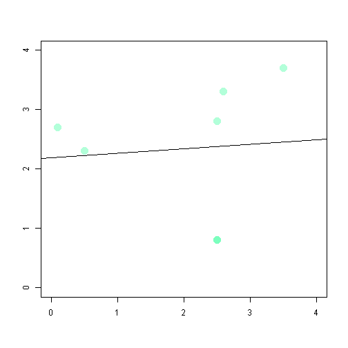

Display Effect on Regression Line by adding new data points
========================================================
author: Abhay S Thakur
date: 27-SEP-2015

Summary
========================================================

The application displays the effect of regression line on
each additon of a new data point. For comparison the older
regression line is also shown to see how the new point 
effects the slope of the regression.

Real world Application
========================================================
The real pitch for this simple application is in classrooms
to teach the young minds about salient points that they 
would observe while playing with the app.

- Initially the regression line jumps a lot for fewer data point
- As data points increase the shifts become gradual
- Large data points are less effected by the outliers
- we could also show how otherwise a linear relationship closely 
 following the majority data gets distorted by out lying points

Slide With Plot
========================================================

Sample output of plot  

 

Q&A
========================================================

*Instructions - Please refer to in App instructions page*
  
*Question & Answers session*
